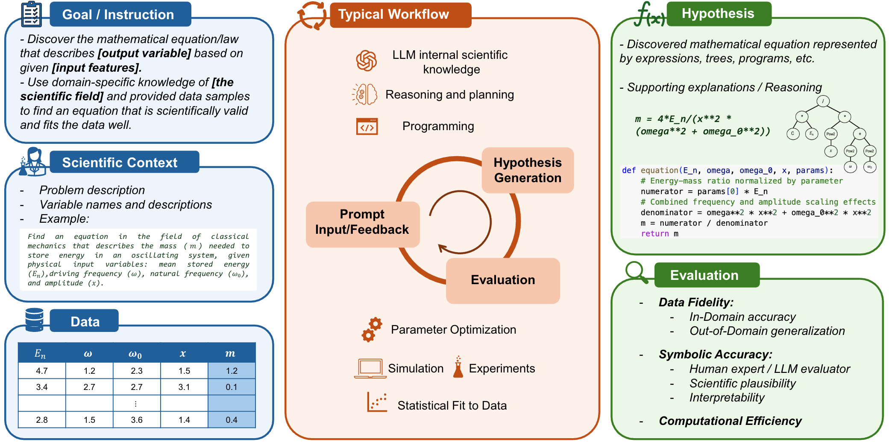

# LLM-SRBench

This is the official repository for the paper "LLM-SRBench: A New Benchmark for Scientific Equation Discovery with Large Language Models"




## Overview
In this paper, we introduce LLM-SRBench, a comprehensive benchmark with $239$ challenging problems across four scientific domains specifically designed to evaluate LLM-based scientific equation discovery methods while preventing trivial memorization.
Our benchmark comprises two main categories: LSR-Transform, which transforms common physical models into less common mathematical representations to test reasoning beyond memorization,
and LSR-Synth, which introduces synthetic, discovery-driven problems requiring data-driven reasoning.
Through extensive evaluation of several state-of-the-art methods on LLM-SRBench, using both open and closed LLMs, we find that the best-performing system so far achieves only $31.5\%$ symbolic accuracy.
These findings highlight the challenges of scientific equation discovery, positioning LLM-SRBench as a valuable resource for future research.

## Updates

* **13 Apr, 2025**: Primary release

## Get Started

### Installation

To run the code, create a conda environment and install the dependencies provided in the `requirements.txt` or `environment.yml`:

```
conda create -n llmsrbench python=3.11.7
conda activate llmsrbench
pip install -r requirements.txt
```

Note: Requires Python ≥ 3.9

You also need to install other packages for each search method from their original github repositories.
  - [llmsr](https://github.com/deep-symbolic-mathematics/LLM-SR)
  - [lasr](https://github.com/trishullab/LibraryAugmentedSymbolicRegression.jl)
  - [SGA](https://github.com/PingchuanMa/SGA)


### Datasets

The data for the benchmark will be automatically downloaded.

### Supported methods

We provide implementation for [llmsr](https://github.com/deep-symbolic-mathematics/LLM-SR), [lasr](https://github.com/trishullab/LibraryAugmentedSymbolicRegression.jl), [SGA](https://github.com/PingchuanMa/SGA) in the `methods` folder.

In order to include a new method, please refer to the implementing section for detailed instructions on how to add a new search method to the project. This includes setting up the necessary configurations, implementing the searcher class, and ensuring compatibility with the existing framework.

### How to runs
1. Select the correct conda environment
2. Start a local LLM server. Our implementation using vllm but you can use any other libraries and just need to implement it in the searcher class.
3. Set correct values for environment variables in `.env` file. Copy `.env.example` to `.env` and set:
   - `VLLM_API_KEY`: API key for local vLLM server (e.g. 'token-abc123')
   - `OPENAI_API_KEY`: OpenAI API key if using OpenAI models
   - `SGA_PYTHON_PATH`: Path to Python executable in your SGA conda environment if using SGA searcher.

4. Run the `eval.py` script with the following arguments:
   - `--searcher_config`: Path to YAML config file for the searcher (required)
   - `--dataset`: Name of dataset to evaluate (required)
   - `--ds_root_folder`: Root folder containing dataset files (optional)
   - `--resume_from`: Path to previous run directory to resume from (optional)
   - `--problem_name`: Name of specific problem to evaluate (optional)
   - `--local_llm_port`: Port number for local LLM server (optional)
    
    Options for datasets are:
    * feynman
    * lsrtransform (lsr-transform)
    * matsci (lsr-synth)
    * chem_react (lsr-synt)
    * phys_osc (lsr-synth)
    * bio_pop_growth (lsr-synth)

The run will create log files at the `logs` folder. You can resume your run with option `--resume_from <log_dir>`. For example, 
`--resume_from logs/MatSci/llmsr_4_10_10/01-16-2025_17-41-04-540953`. This will skip finished equations.

The working directory will be in the following format:

```
project
│   README.md
|   eval.py
|   .env
└───bench/
|
└───methods/
|   └───direct
|   └───llmsr
|   └───lasr
|   └───sga_sr
|
└───datasets/
|
└───logs/
    └───<dataset-name>
        └───<method-name>
            └───<date>
```

### Evaluation scripts

Please take a look at `example_script.sh` for examples of usage with a local LLM.

## Implementing a new searcher

A new searcher will need to inherit the following base class

```python
class BaseSearcher:
    def __init__(self, name) -> None:
        self._name = name

    def discover(self, task: SEDTask) -> List[SearchResult]:
        '''
        
        Return:
            equations
            aux
        '''
        raise NotImplementedError

    def __str__(self):
        return self._name
```

The input `task` will provide a description of the target equation, description of input variables, and training data points.

After implementing your searcher, you will need to create a config file in the `configs` folder. An example is

```yaml
name: Llmsr-Llama31_8b
class_name: LLMSRSearcher
api_type: "vllm"
api_model: "meta-llama/Llama-3.1-8B-Instruct"
api_url: "http://localhost:{}/v1/"
global_max_sample_num: 1000
samples_per_prompt: 4
num_islands: 10
```

The `eval.py` will load the config to initialize a searcher.